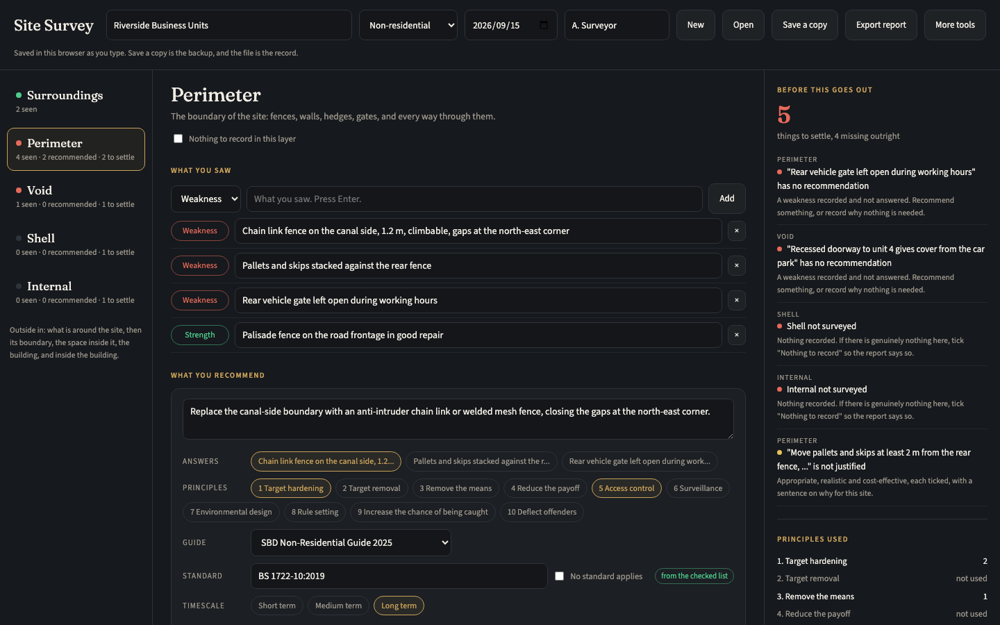

# Site Survey

**A site security survey that shows its own gaps.**

**Open it here:** [adriaanbosch.net/site-survey](https://adriaanbosch.net/site-survey/site-survey.html)

No install, no account, no subscription. Click the link and it runs in your browser. adriaanbosch.net hands you the tool; it never sees what you put into it. Everything you type stays in your browser, on your device.



---

## The problem it was built for

A site security survey is usually written into a Word template. The structure is sound: look at the site from the outside in, write down what you saw, and recommend what to do about it.

What a template cannot do is tell you when something is missing. A weakness noted on the walk round never gets a recommendation. A recommendation cites no standard, or one that was replaced years ago. A whole part of the site is skipped. The report still looks finished.

Two people surveying the same site also rarely produce reports that look alike, which makes them slow to review and hard to compare.

This tool keeps the structure and adds what the template cannot. It shows the gaps as you work, and it writes the report for you.

## Who it is for

Anyone who surveys a site for crime and security. A designing out crime officer, a security manager, a facilities lead, a consultant, or someone looking after a community building. It needs no specialist software and no training in the tool.

## What it will not do

**It does not judge the risk.** What is acceptable for a site is the surveyor's advice and the owner's decision.

**It names standards, never products or brands.**

**It does not pretend a citation was checked.** Measures picked from its lists carry standards that were checked as current. Anything you type yourself is shown as your own, and the report says so.

---

## How it works

### From the outside in

The site is read in five layers, in order: the surroundings, the perimeter, the void (the space between the boundary and the building), the shell of the building, and the inside. Each layer shows how much you have recorded and whether anything is still missing.

### What you saw, then what you recommend

Type what you saw in a few words and press Enter, marked as a weakness or a strength. Then add recommendations. Each one says which weakness it answers, which crime prevention principles it applies, the Secured by Design guide and the standard it follows, a timescale, and why it is appropriate, realistic and cost-effective for this site.

### Pick rather than type

Every layer that takes recommendations has a list of common measures. Each carries its principles, its standard and a usual timescale. Add one, link it to the weakness it answers, and add what is specific to this site.

Adding a measure from the list does not close a gap on its own. It has to be linked to something you saw, or a generic list would pass as a survey.

### The gaps show as you go

The right-hand column lists what to settle before the report goes out: a weakness with no recommendation, a layer not surveyed, a recommendation with no principle, standard, timescale or justification. Click one to go straight to it.

It also shows which of the ten principles you have used, and the advice sorted into short, medium and long term.

### The report writes itself

**Export report** builds a Word document that opens in Word, Pages, Google Docs and LibreOffice. It follows the survey layer by layer, numbers each recommendation, and summarises the advice by timescale.

It ends with a section called **Not yet settled**, listing anything still open. A report that looks finished when it is not is worse than one that says so.

---

## Getting started

1. Open [the tool](https://adriaanbosch.net/site-survey/site-survey.html). There is nothing to install.
2. Name the site, and say whether it is residential or not. That sets which Secured by Design guide the recommendations point to.
3. Work through the layers from the top. If a layer has nothing to record, tick **Nothing to record in this layer**, so the report says so.
4. Settle what the right-hand column lists, then press **Export report**.
5. Press **Save a copy** to keep the survey itself.
6. Bookmark the link, and come back to it in the same browser.

**Want to check it never sends your data anywhere?** Once the page has opened, switch off your Wi-Fi and carry on. It still saves and still exports, because nothing in it needs the website to handle what you type.

---

## Your data

**The saved file is the record. The browser is a cache.**

What you enter is kept in the browser you used, on the device you used. A private window forgets it when you close it, and clearing your browser's data for adriaanbosch.net clears it too.

**Save a copy** gives you a file with the whole survey, and **Open** brings it back. Opening a file reconciles as it goes: how many observations and recommendations were in the file, how many were read in, and anything left out and why.

A file from a different tool is refused, and nothing is changed.

## Privacy, and how to check it rather than trust it

There are no network calls of any kind. No analytics, no telemetry, no fonts, no sync, no sign-in.

You do not have to take that on faith. With the tool open, right-click the page, choose **View Page Source**, and search for these three:

```
fetch(          XMLHttpRequest          WebSocket
```

Those are the ways a web page asks the internet for something. There are none of them in here.

Search for `http` as well and you will find eight. One is an ordinary link you would have to click, to the other tools on adriaanbosch.net. The other seven are not addresses the page visits. They are fixed labels that every Word file carries inside it, and the tool writes them when it builds the report. None of them loads anything.

---

## Requirements

A browser, and a connection to open the page. Once it is open it keeps working without one. It is easiest on a laptop or desktop, where the layers, the survey and the gaps sit side by side.

## Standards and guides in the lists

Checked as the current editions on 15 September 2026. Standards are revised, so check the edition before relying on one in a report.

- **Perimeter:** LPS 1175 Issue 8, BS 1722-10:2019, BS 5489-1:2020, BS EN IEC 62676-4:2025, PAS 170-1:2017
- **Void:** BS 5489-1:2020, BS EN IEC 62676-4:2025, the Park Mark Safer Parking Award
- **Shell:** PAS 24:2022+A1:2024, LPS 1175 Issue 8, BS EN 1627:2021, BS EN 356:2000, BS 3621:2017, DHF TS 008:2022
- **Internal:** PD 6662:2017 with BS EN 50131-1, BS 8243:2021, the NPCC police response policy (its latest annual edition), BS EN 1143-1:2019, BS EN IEC 62676-4:2025
- **Guides:** SBD Residential Guide 2025, SBD Non-Residential Guide 2025, SBD Lighting Against Crime Guidance 2026

## Credit

The survey method follows the site security survey taught on the Level 5 Diploma in Crime Prevention (Designing Out Crime), delivered by the Police Crime Prevention Academy and awarded by ProQual: the site read from the outside in, and each recommendation tied to a principle, a Secured by Design guide, a standard, a timescale and an appropriate, realistic and cost-effective justification.

The principles are the 10 Principles of Crime Prevention used by UK police crime prevention officers.

The tool is written in its own words. It is not produced or endorsed by the Police Crime Prevention Academy, ProQual or Secured by Design.

## More tools

Site Survey is one of a set of security tools that work the same way. [See the others](https://adriaanbosch.net/#tools).

## Licence

MIT.
